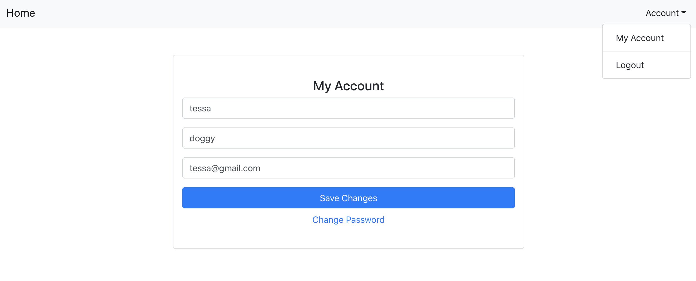

# MERNLogin
Authentication app using the MERN stack.

# Features
Allows user's to register an account and login. Uses bcryptjs to hash password.

  

Allows user's to view and update their account information. Uses private routes so that only authenticated users can view the dashboard and account page. 
Uses jsonwebtoken and passport-jwt to authenticate endpoints. 

 

Allows user to recover a lost password. If a valid account email address is entered, an email containing a URL to reset the password will be sent. 
The reset password link is only valid for a certain amount of time and can only be used once.

 

